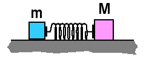

## The question for students:

{: .image-right } 

Two blocks, M=2m, sit on a horizontal frictionless surface with a
compressed massless spring between them.  After the spring is released 
M has velocity v.   The total energy initially stored in the spring was:

1. mv2
2. 2mv2
3. 3mv2
4. 4mv2
5. 5mv2
6. None of the above.
7. Cannot be determined

## Commentary for teachers:

### Answer

(3) The big mass has kinetic energy mv2 and the small mass
has energy 2mv2.  Some students may answer (6) because they
have confused M and m.  It is important to determine the reasons that
any student might select (7).  They might be unwilling to assume that
the system is initially at rest.  Students taking this perspective
should not be disconfirmed but congratulated for making a critical
interpretation of the wording.
