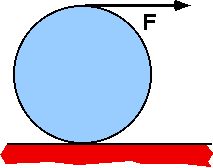

{: .image-right } 

A uniform disk with R=0.2m rolls without slipping on a horizontal
surface.  The string is pulled in the horizontal direction with force
15N. The disk's moment of inertia is 0.4 kg-m2. The friction
force on the disk is:

1. 0
2. 15N, to the right
3. 10N, to the left
4. 5N, to the right
5. 5N, to the left
6. None of the above
7. Cannot be determined

### Answer

(4) This problem can be done without the arithmetic complication of
finding the mass from the center-of-mass moment of inertia. This is an
excellent problem for stressing multiple solution methods. This is a
situation where two equations are needed. They can be either the linear
dynamical relation and a rotational dynamical relation, or just two
rotational relationships about different points. Some students may
answer (7) because they are unfamiliar with the expression for moment of
inertia about the CM or because they do not know the Parallel Axis
theorem.
