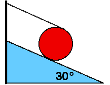

{: .image-right } 

A uniform disk with mass M and radius R sits at rest on an incline
30&deg; to the horizontal.  String is wound around disk and attached to
top of incline as shown.  The string is parallel to incline.  The
tension in the string is :

1. Mg
2. Mg/2
3. 2Mg/5
4. Mg/4
5. None of the above
6. Cannot be determined

### Answer

(4) This problem can be solved a variety of ways. The simplest method is
to balance torques about the contact point. This situation is an
excellent one for discussing the advantages of thinking about preferred
points about which to write the rotational dynamics equation.
