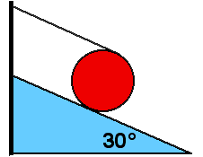

{: .image-right } 

A uniform disk with mass M and radius R sits at rest on an incline
30&deg; to the horizontal.  A string is wound around disk and attached
to top of incline as shown.  The string is parallel to incline.  The
friction force acting at the contact point is:

1. Mg/2, down the incline
2. Mg/2, up the incline
3. Mg/4, up the incline
4. Mg/0.86, down the incline
5. None of the above
6. Cannot be determined

### Answer

(3) Balancing torques about the center of the disk determines that the
friction force points up and is equal to the tension in the string. (The
other forces, gravity and normal pass through the point and contribute
no torques.) Balancing torques about the contact point determines the
tension readily.
