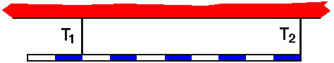

## The question for students:

A uniform rod of length L, mass M, is suspended by two thin strings. 
Which of the following statements is true regarding the tensions in the
strings?

1. T2 = T1
2. T2 = 2.5T1
3. T2 = 0.6T1
4. T2 = 0.8T1
5. None of the above

## Commentary for teachers:

### Answer

(3) The ratio is most easily found by considering torques about the
center of the bar.  The distances of the strings to the center of the
bar need to be determined visually from the figure.
