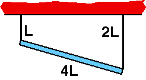

{: .image-right } 

A uniform rod of length 4L, mass M, is suspended by two thin strings,
lengths L and 2L as shown.  What is the tension in the string at the
left end of the rod?

1. Mg
2. Mg/2
3. Mg/3
4. Mg/4
5. None of the above

### Answer

(2) For many this is straightforward but a few students are confused
about the effect of the unequal lengths of string.
...
