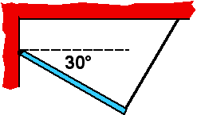

## The question for students:

{: .image-right } 

A uniform rod is hinged to a wall and held at a 30&deg; angle by a thin
string that is attached to the ceiling and makes a 90&deg; angle to rod.
Which statement must be true?

1. The hinge force is purely vertical.
2. The hinge force is purely horizontal.
3. The string tension equals the hinge force.
4. The string tension is less than the rod's weight

## Commentary for teachers:

### Answer

(4) This is easily determined by considering torques about the hinge.
The hinge force cannot be purely vertical because there is a horizontal
component to the tension that must be balanced. Also the hinge force
cannot be purely horizontal or the rod would rotate counterclockwise
about its center. Since the hinge force must have a horizontal component
in the opposite direction as the horizontal component of the tension,
(3) cannot be true either.
