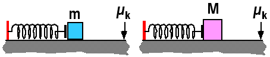

## The question for students:

Consider the two situations shown above.  The springs are identical and
are compressed the same amount, but the masses are different with M > m.
The surfaces they sit on have the same non-zero coefficient of friction.
Both start from rest. Which mass has the largest speed when the spring
reaches its relaxed length?

1. m
2. M
3. Both have the same speed.

## Commentary for teachers:

### Answer

(1) Friction is only a confounding element. The lighter mass will have
the greater speed whether or not there is friction.

Students may correctly reason that the friction force will be less on m
and less of the potential energy stored in the spring will be dissipated
as the spring returns to its relaxed length. While true this is not
relevant for the question.

This is an instance where it is important to elicit student reasoning.
It is a case where students can use wrong reasoning to get the correct
answer.
