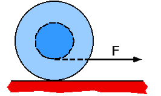

{: .image-right } 

A spool has string wrapped around its center axle and is sitting on a
horizontal surface.  If the string is pulled in the horizontal direction
when tangent to the bottom of the axle, the spool will

1. roll to the right.
2. not roll, only slip.
3. roll to the left.
4. can't be determined.

### Answer

(1) For many students this is really counterintuitive.
...
