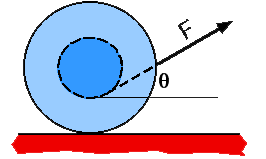

{: .image-right } 

A spool has string wrapped around its center axle and is sitting on a
horizontal surface.  If the string is pulled at an angle to the
horizontal when drawn from the bottom of the axle, the spool will

1. roll to the right.
2. not roll, only slip.
3. roll to the left.
4. cannot be determined.

### Answer

(4) The motion of the spool depends upon the angle θ. When the line of
action of the force passes through the contact point the spool will
slide and not rotate. At lower angles it will roll to the right and at
higher angles it will roll to the left.
