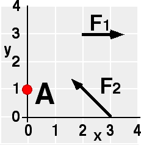

## The question for students:

{: .image-right } 

Which of the following statements is true about this situation?

1. There are no points having zero total torque.
2. There is one point having zero total torque.
3. There are many points having zero total torque.

## Commentary for teachers:

### Answer

(3) Many students realize that there is at least one point, the
intersection of the lines of action of the two forces, having zero
torque. A drawing is usually sufficient to convince students that there
is an entire line along which the torque is zero.
