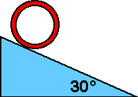

{: .image-with-caption } 

A hoop of mass 4 kg and radius r rolls
without slipping down an incline 30&deg; to the horizontal.  The hoop is
released from rest.  What is the speed of the hoop after its center has
fallen a distance h?

1. (4g(h-r))1/2
2. (2gh)1/2
3. (gh)1/2
4. (0.5g(h+r))1/2
5. none of the above
6. cannot be determined

### Answer

(3.) Students should realize that the speed cannot depend upon the
radius.  Answer #2 is the speed that a falling point mass would have and
the hoop must have less than that.
...
