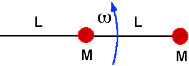

{: .image-with-caption } 

A system consisting of two masses on a string is rotating with angular
velocity &omega; on a frictionless horizontal surface. The center of
rotation is the left-hand side of the string (nailed to the table).

The ratio of the tension in the inner string to that in the outer string
is

1. 0.25
2. 0.5
3. 1.5
4. 2.0
5. 3.0
6. None of the above

### Answer

(3) Many students think the ratio is determined just by the string
lengths and give as an answer either (2) or (4). They fail to draw a
free body diagram for the inner mass and, consequently, fail to realize
that it is the net force on the inner mass that must maintain the
circular motion of the inner mass.
...
