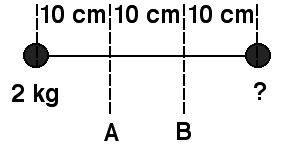

{: .image-with-caption } 

The rotational inertia of the dumbbell (see figure) about axis A is
twice the rotational inertia about axis B. The unknown mass is

1. 2 kg
2. 4 kg
3. 5 kg
4. 7 kg
5. 10 kg
6. None of the above
7. Cannot be determined

### Answer

(4) Students can get bogged down in calculations when it is unnecessary
to do detailed calculations. Proportional distances to the axes is all
that is needed. This problem presents a good opportunity to discuss
problem solving procedures.
...
