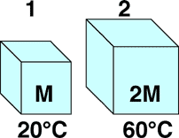

## The question for students:

{: .image-right } 

Two thermodynamic systems are made from the same material. The specific
heat of this material is independent of temperature. The bodies have
different masses and, initially, different temperatures as shown. If the
bodies are placed in thermal contact the final equilibrium temperature
is most nearly

1. 27 C
2. 33 C
3. 40 C
4. 47 C
5. None of the above
6. Cannot be determined

## Commentary for teachers:

### Answer

(4) It is valuable to ask students how they obtained their answer. Each
of the offered answers is obtained by a common conceptual or algebraic
mistake.
