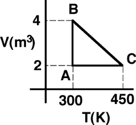

{: .image-right } 

One mole of an ideal monatomic gas is taken around the cycle shown.

The work done on the system during the process B to C is

1. Positive
2. Negative
3. No work is done on the system
4. Cannot be determined

### Answer

(1) Positive work is done ON the system. Since the path on a V-T diagram
is a straight line, the process is isobaric.
