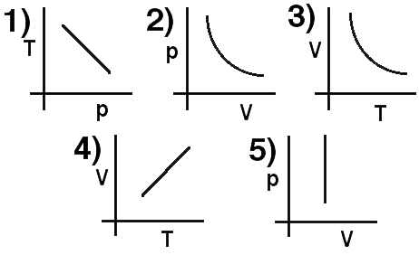

A quantity of ideal gas undergoes a thermodynamic process.  Which curve
represents an isobaric path?

### Answer

(4) If V is linearly related to T the perfect gas law implies that the
pressure is constant.
