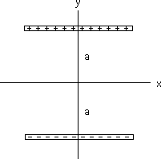

{: .image-with-caption } 

Two uniformly charged rods are positioned horizontally as shown.  The
top rod is positively charged and the bottom rod is negatively charged.
The total electric field at the origin

1. Is 0. 
2. Has both an x and a y component. 
3. Points totally in the <b>i</b> direction.
4. Points totally in the <b>-i</b> direction. 
5. Points totally in the <b>j</b> direction. 
6. Points totally in the <b>-j</b> direction.

### Answer

(6) Along the y-axis, by symmetry, the electric field due to either rod
points along the y-axis.  At the origin the contribution to each rod is
the same and points down.
...
