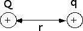
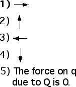

## The question for students:

{: .image-right } 

Two positive charges, Q and q, are positioned as shown in the diagram. 
What is the direction of the electrical force on q due to Q?

## Commentary for teachers:

### Answer

(1) The force is repulsive.
