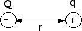
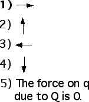

{: .image-right } 

Two charges, a negative charge Q, and a positive charge q, are
positioned as shown in the diagram.  What is the direction of the
electrical force on q due to Q?

### Answer

(3) The force is attractive.
