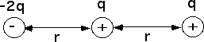
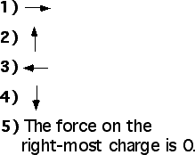

{: .image-right } 

Three charges are positioned on the x-axis as shown.  What is the
direction of the electrical force on the right-most charge?

### Answer

(1) Students who forget to square the denominator in Coulomb's law will answer (5).

...
