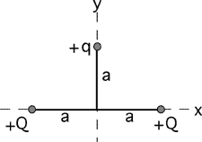

{: .image-with-caption } 

What is the size of the electrical force on the charge q shown in the diagram? 

1. &radic;2kqQ/(4a2)
2. kqQ/a2
3. &radic;2kqQ/(2a2)
4. kqQ/(2a2)
5. None of the above

### Answer

(3) It is a common mistake to forget to take the y-component of the
force.
...
