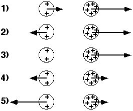

## The question for students:

The diagrams show two uniformly charged spheres.  The charge on the
right sphere is three times as large as the charge on the left sphere. 
The arrows on each charge represent the force on the charge.  Which
force diagram best represents the magnitude and direction of the
electric forces on the two spheres?

## Commentary for teachers:

### Answer

(4) By Newton's third law the forces are equal and opposite.
