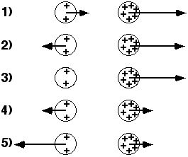

## The question for students:

The diagrams show two uniformly charged spheres.  The charge on the
right sphere is three times as large as the charge on the left sphere. 
Each vector represents <u>the electric field at the center of one sphere
caused by the other sphere</u>.  Which choice best represents the
magnitude and direction of the electric field vectors caused by one
sphere at the position of the other sphere?

## Commentary for teachers:

### Answer

(5) The electric field at the sphere with smaller charge is three times
larger than the field at the sphere with larger charge.
