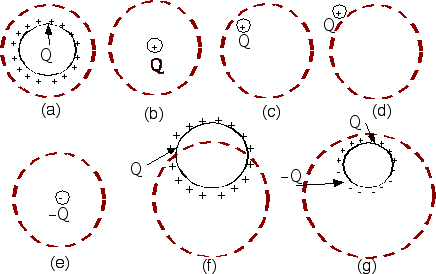

## The question for students:

Consider the flux through the following spherical Gaussian surfaces.
Take each charge distribution to be either a point charge or a spherical
shell of charge (uniformly distributed). For which situation is the flux
greatest?

1. a and c
2. a, b, and c
3. b
4. a
5. b, c, and e
6. a, f, and g
7. b, c, and g
8. Other

## Commentary for teachers:

### Answer

(2) All these have the same flux. Some students do not read the question
carefully and think the number of '+' signs matter.
