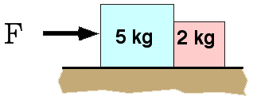

Two blocks rest on a frictionless surface. Both blocks move to the right
with acceleration of 2 m/s2.  The force on the big block due
to the small block is

1. 14N to the right
2. 10N to the left
3. 8N to the right
4. 6N to the left
5. 4N to the right
6. 2N to the left
7. none of the above
8. cannot be determined

### Answer

(7) The force on the small block must cause the specified acceleration.
The 3rd law requires that the force on the big block be equal and
opposite. The magnitude is 4N but it is directed to the left.
...
