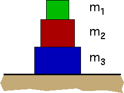

{: .image-with-caption } 

If m2 = 2m1 , m3 = 3m1  and
the force that the surface exerts on the bottom block is 120N, the mass
of the large block is

Use g = 10 N/kg.

1. 2 kg
2. 4 kg
3. 6 kg
4. 8 kg
5. 12 kg
6. 20 kg
7. none of the above

### Answer

(3) the most common other answers are #1 and #6, each of which
represents a typical mistake students make. This problem presents a good
opportunity to encourage students to check their answer.
...
