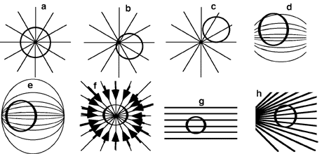

## The question for students:

The circles in the picture below are Gaussian surfaces. All other lines
are electric field lines. For which cases is the flux <i>non</i>-zero?

1. a
2. a, b, and f
3. a, b, e, and f
4. a, b, d, e, and h
5. a and b
6. All but g
7. All of them
8. None of the above
9. Cannot be determined

## Commentary for teachers:

### Answer 

(2) As "follow-up" it is good to ask questions about comparisons
between two or more of the situations. For example, which is flux is
larger, a or f? Such questions help determine what students are focused
upon; are they keying on number of lines, do they understand that the
flux can be negative.
