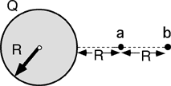

{: .image-right } A uniform volume distribution of
charge has radius R and total charge Q.  A point charge -q is released
from rest at point b, which is a distance 3R from the center of the
distribution. When the point charge reaches a, which of the following is
true regarding the potential energy, U?

1. Ua = -Ub
2. Ua = -2Ub/3
3. Ua = -3Ub/2
4. Ua = -9Ub/4
5. Ua = Ub
6. Ua = 2Ub/3
7. Ua = 3Ub/2
8. Ua = 9Ub/4
9. None of the above
10. Cannot be determined

###Answer 

(7) Many students use an inverse square dependence appropriate
for fields. Others will take the field at b and multiply by the
displacement. Still others will assert that the potential doubles
because they are using the distance to the surface of the sphere.
...
