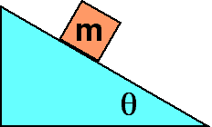

{: .image-right } A block of mass m sits at rest on a
rough incline of angle &theta;.  The coefficient of static friction is
&mu;.

The friction force on the block is

1. mgcos(&theta;), down the incline.
2. mgsin(&theta;), up the incline.
3. &mu;mgsin(&theta;), down the incline.
4. &mu;mgcos(&theta;), up the incline.
5. none of the above.
6. cannot be determined

### Answer 

(2) this is all that is needed to hold the block at rest. Some
students will give #4 as the answer having specified the maximum static
friction force.

It helps to classify forces as model forces obtainable from a formula,
and procedure forces. Static friction is an example of a procedure
force, one that cannot be determined without application of the 2nd law.
