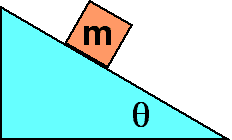

{: .image-right } A
block of mass m, when placed on a rough inclined plane and moved, moves
down the plane with constant speed.  If a block of mass 2m were placed
on the same incline and moved, it would ...

1. return to rest.
2. accelerate until the speed is half.
3. move with some constant speed.
4. None of the above.
5. Cannot be determined

### Answer 

The block will have the same motion. Both the gravitational force
and the friction force scale with the mass so there is no net force in
either case.
