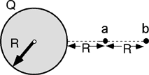

{: .image-with-caption } A
uniform volume distribution of charge has radius R and total charge Q. 
A point charge -q is released from rest at point b, which is a distance
3R from the center of the distribution. When the point charge reaches a,
which of the following is true regarding the total energy, E?

1.  Ea = -Eb
2. Ea = -2Eb/3
3. Ea = -3Eb/2
4. Ea = -9Eb/4
5. Ea = Eb
6. Ea = 2Eb/3
7. Ea = 3Eb/2
8. Ea = 9Eb/4
9. None of the above
10. Cannot be determined

###Answer 

(5) Students often forget to include the kinetic energy,
especially after a lot of discussion of potential energy. Many will
simply misinterpret the energy to mean potential energy. Teasing apart
these issues is important.
...
