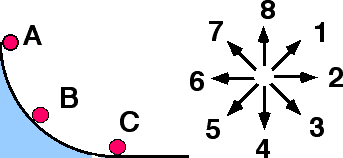

A small ball is released from rest at position A and rolls down a
vertical circular track under the influence of gravity.

 When
the ball reaches position B, which of the indicated directions most
nearly corresponds to the direction of the ball's acceleration?

Enter (9) if the direction cannot be determined.

###Answer 

(2) At position B the acceleration has a tangential component and
a radial component. Both components can be determined at position B.
Worked out carefully one gets 18 degrees above position #2. It is common
for students to neglect one component or the other.

