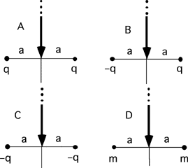

{: .image-right } For
the following situations consider moving a positive charge from very far
away to the origin along the y-axis.  For which situation would you do
the most work?

1. A
2. B
3. C
4. D
5. A & C
6. None of the above.
7. Cannot be determined

### Answer 

(1) Students indicating #7 because they do not know if the masses
are charged should not be disconfirmed. If students key on magnitude
only they will likely choose answer #5.

