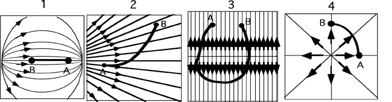

## The question for students:

In each of the situations below a negative charge is moved along a path
from point A to point B in the presence of an electric field, as shown. 
For which situation is the increase in potential energy the greatest?

## Commentary for teachers:

### Answer 

(2) In case 1 the charge moves to a lower potential energy. In
case 3 the charge returns to a point having the same distance to the
plane of charge as it originally had, meaning no net work. In case 4 the
charge moves along an equipotential and no work is done. Students should
be asked to identify the charge configuration that could account for
each of these field situations. They can also be asked for which case is
the electrostatic potential change the greatest.
