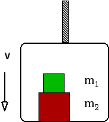

{: .image-right }  Block
m1 sits on block m2 and both sit on the floor of
an elevator at rest.  When the elevator starts to  move down, the normal
force on the upper block will ...

1. increase.
2. remain the same.
3. decrease.
4. Cannot be determined

### Answer 

(3) As it starts the elevator must accelerate downward and so
will the upper block. The only forces on the block are gravity and the
normal force. The normal force must diminish so gravity can provide the
downward acceleration.

Students answering #2 may have interpreted the question to mean 'as the
elevator moves' and think that the elevator moves with constant velocity.
