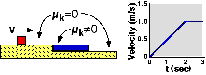

## The question for students:

A
block slides along a frictionless surface and onto a slab with a rough
surface.  The plot on the right shows the velocity of the blue slab as a
function of time. The slab has mass of 4kg and the block has mass of
2kg.  What is the friction force on the small block at t = 1 second?

1. 0.5 kg-m/s2
2. 0 kg-m/s2
3. 1 kg-m/s2
4. 4 kg-m/s2
5. 2 kg-m/s2
6. None of the above
7. Cannot be determined

## Commentary for teachers:

### Answer 

(5) The acceleration of the slab can be found from the plot. The
only force on the slab in the horizontal direction is the friction force
so it must be responsible for the acceleration. The force on the block
can then be found using the 3rd law.

