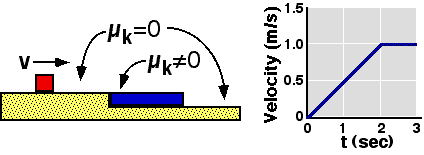

 A
block slides along a frictionless surface and onto a slab with a rough
surface.  The plot on the right shows the velocity of the blue slab as a
function of time.  The slab has mass of 4kg and the block has mass of
2kg.  If the block remains on top of the slab, what was its initial
speed?

1. 2 m/s
2. 4 m/s
3. 6 m/s
4. 8 m/s
5. 12 m/s
6. None of the above
7. Cannot be determined

### Answer 

(6) The block initially has velocity 3 m/s. This problem is
difficult for students. They generally have difficulty obtaining
relevant information from a diagram. In this case they must use the plot
to tell that the final velocity is 1 m/s.
