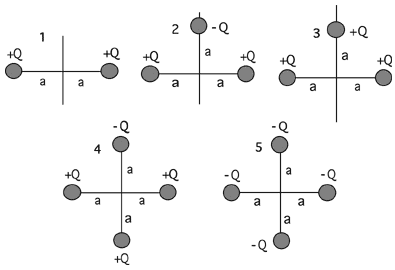

Which of the following charge distributions has the lowest potential
energy?

###Answer 

(2) Encourage students to reason to the answer rather than write
formal expressions for each case. They should be able to perceive that
cases #1, #3 and #5 all have positive PE. Situation #4 has zero energy
as can be seen by assembling subunits, then moving the two positive
charges along the zero equipotential of the charges on the y-axis.
Finally, situation #2 is clearly negative.

A good follow-up question is to ask students to order the cases
according to increasing potential energy.
...
