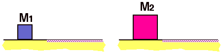

 Two
blocks, M2 > M1, having the same kinetic energy
move from a frictionless surface onto a surface having friction
coefficient &mu;k.

Which goes further before stopping?

1. M1
2. M1
3. Both go the same distance
4. Cannot be determined

###Answer 

(1) For a given amount of kinetic energy M1 will have a larger
velocity. The penetration distance depends upon the square of the
velocity.

Many students will notice that the relationship equating the kinetic
energy to work by friction has mass as a factor on both sides and will
answer #3. They are assuming that the masses have the same velocity, not
the same kinetic energy.
