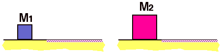

 Two
blocks, M2 = M1 but of different sizes, having the
same speed, move from a frictionless surface onto a surface having
friction coefficient &mu;k.

Which stops in the shorter time?

1. M1
2. M2
3. Both stop in the same time
4. Cannot be determined

###Answer 

(3) Both blocks will experience the same acceleration. If they
have the same initial velocity, they will stop in the same time.
...
