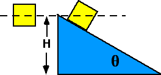

{: .image-right } Two
identical blocks fall a distance H. One falls directly down, the other
slides down a frictionless incline.  Which has the largest speed at the
bottom?

1. The one falling vertically
2. The one on the incline
3. Both have the same speed
4. Cannot be determined

###Answer 

(3) The only force doing work is gravity and both block undergo
the same vertical displacement.
...
