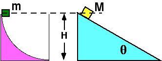

 Two
masses, M > m, travel down the surfaces shown.  Both surfaces are
frictionless.  Which mass has the largest <u>average</u> speed during
their motion?

1. m
2. M
3. Both have the same average speed
4. Cannot be determined

### Answer 

(1) This problem is intended to promote discussion of average
speed. Both masses have the same speed at the bottom. Mass m has a
larger acceleration in the beginning because the circular track is
vertical at the outset. Although the angle of the incline is not
specified, the angle is irrelevant. All inclines will have the same
average speed. A simple graph of the speed of each mass versus time
shows that m will have the larger average speed.
