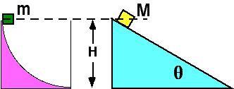

## The question for students:

 Two
masses, M > m, travel down the surfaces shown.  Both surfaces are
frictionless.  Which mass has the largest speed at the bottom?

1. m
2. M
3. Both have the same speed
4. Cannot be determined

## Commentary for teachers:

### Answer 

(3) By energy considerations, both would have the same speed.
Students frequently get confused about the mass, thinking that the
larger mass has the greatest potential energy change and therefore has
the greatest speed.
