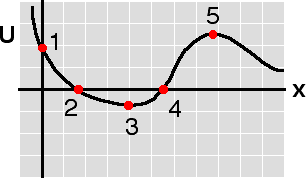

{: .image-right }  The
potential energy function for a certain body is shown at right. For
which points is Fx = 0?

1. Point 1 only
2. Points 2 and 4
3. Points 1 and 5
4. Points 3 and 5
5. Point 3 only
6. Fx not equal to 0 anywheree

###Answer 

(4) The force is given by the negative of the slope of the
potential function. Points 3 and 5 are equilibrium points, but only 3 is
a stable equilibrium point. Students frequently choose answer #2
thinking that the force is zero at these points.
