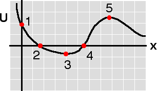

{: .image-right }  The
potential energy function for a certain body is shown at right. The
force associated with this potential is ...

1. conservative.
2. dissipative.
3. neither conservative or dissipative.
4. Cannot be determined

### Answer 

(1) It is remarkable how many students will select one of the
other answers. Many students do not recognize that you cannot have a
potential function unless the force is conservative.
