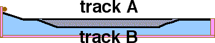

Two identical steel balls are released from rest from the same height,
and travel along tracks as shown and labeled below.

Which ball reaches the end of its track first?

1. ball on track A
2. ball on track B
3. they reach the end at the same time
4. not enough information

###Answer 

(2) The ball on track B accelerates down the second slope. A
component of this acceleration is in the x-direction. This means that
the x component of ball B's velocity is never smaller than that of ball
A. Since the tracks have the same x-dimension, ball B gets there first.

A large majority of students choose answer C incorrectly thinking that
since the balls return to the same height, they have the same speed and,
therefore, arrive at the same time.
