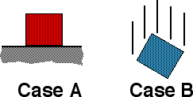

## The question for students:

{: .image-right }  The
two blocks shown below are identical.  In case A the block sits on a
horizontal surface and in case B the block is in free fall.  Which
statement is correct regarding the impulse delivered to the block by the
gravitational force during a time interval &Delta;t?

1. In case A the impulse is zero.
2. In case B the impulse depends upon v.
3. The impulse is larger in case B than A.
4. None of the above
5. Cannot be determined

## Commentary for teachers:

### Answer 

(4) Even students who understand forces and would respond
correctly to this question if asked in terms of forces have difficulty
with this question. Many think that motion matters, or answer the
question as if it was about the net impulse.
