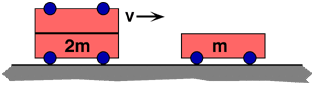

{: .image-right } A cart
of mass 2m collides and sticks to a cart of mass m that is initially at
rest. What is the speed of the combination after the collision?

1. v
2. 2v/3
3. v/3
4. 0
5. None of the above.
6. Cannot be determined.

###Answer 

(2) This question is useful for probing pre-existing ideas about
momentum, and also for distinguishing momentum ideas from kinetic
energy. It should be used just after, or even before, covering momentum
concepts.

Usually students starting momentum already have had some energy, and
kinetic energy in particular. If appropriate, they can be asked if
energy is lost in the collision. Is more or less energy lost if the
carts do not stick together?
...
