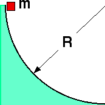

You are given this problem:

<blockquote>

{: .image-right }  A
mass m slides down a frictionless track of radius R=0.5m.  Relative to
the center of curvature, what is the angular acceleration of the mass as
it reaches the bottom of the track. </blockquote>

   What principle would you use to solve the problem MOST
EFFICIENTLY.

1. Kinematics only
2. F = ma or Newton's laws
3. Work-Energy theorem
4. Impulse-Momentum theorem
5. Angular Impulse-Angular Momentum
6. 1 & 2
7. 1 & 3
8. 2 & 3
9. none of the above
10. not enough information given

### Answer 

(7) Students often think this problem requires angular momentum
or angular dynamics. Many cue on anything circular. Some students may
answer #10 thinking that the mass is needed.
